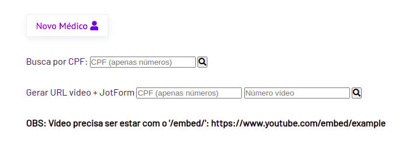
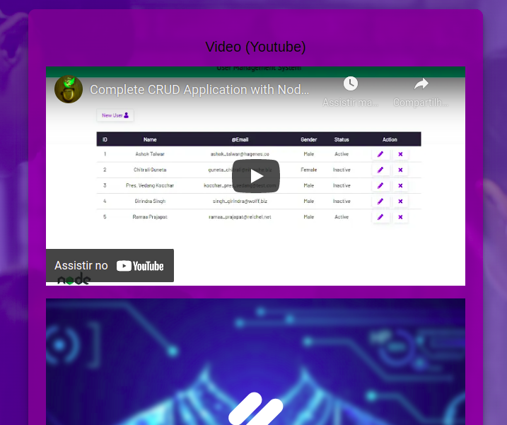
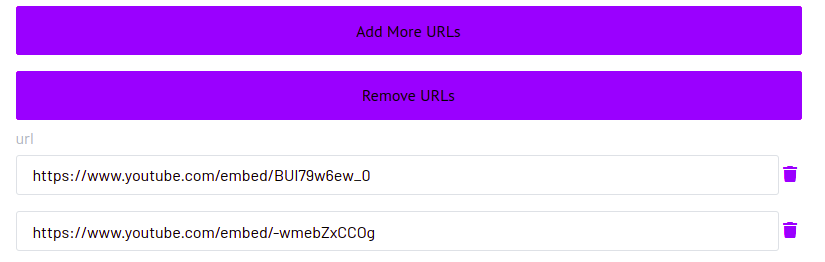

# NodeJs + API (Jotform) + MongoDB 
## Propósito Geral 
###### 04/04/2022
A seguinte aplicação está sendo desenvolvida para um projeto em que participo em parceria da Emprapii com a unidade [ITEC/FURG](https://embrapii.org.br/unidades/unidade-embrapii-em-sistema-roboticos-e-automacao-itec-furg-centro-em-ciencia-de-dados-e-robotica-da-universidade-federal-do-rio-grande/). No projeto, busca-se uma maneira de conseguir gerar formulários com diferentes vídeos do mesmo médico, o qual será enviado ao paciente. Assim, o paciente receberá um questionário específico com um vídeo específico. 

Aproveitei o projeto para também desenvolver mais minhas habilidades no Backend, utilizando ```nodeJs```, ```express```, ```MVC pattern``` dentre outras ferramentas. Atualmente, foram implementados os seguintes recursos:

- ```CRUD``` em ```nodeJs``` para o controle das URLs dos vídeos dos médicos
- Integração com a API do Jotform
- Geração de links contendo o formulário e o vídeo cadastrado
- ```Schedule``` com o ```node-cron``` para salvar novas respostas do formulário em um novo banco de dados (no momento ```MongoDB```)

A estrutura básica do CRUD para o projeto foi criada a partir do seguinte tutorial disponível gratuitamente no [Youtube](https://www.youtube.com/watch?v=W1Kttu53qTg&t=2s). Entretanto, as demais funcionalidades foram implementadas por mim como uma maneira de aprofundar meus conhecimentos :)

### Implemetanções
- Busca por CPF do médico e geração dos links contendo o vídeo


- Nova página com o Jotform + Vídeo Youtube


- Adicionar e remover URLs de um determinado médico



## Instalação
Inicialmente, instale as dependências:
- ```npm i```

Após, é necessário configurar criar o arquivo 'config.env' e adicionar as seguintes variáveis 
```bash
MONGO_URI= suaChaveDoMongoDB
PORT=3000
API_KEY= chaveDoJotForm
FORM_ID= chaveDoFormulárioJotForm

FORM_LIMIT=5
FORM_FILTER="created_at:gt":"2022-03-30 00:00:00"
FORM_ORDERBY=created_at
```
Depois de colocar suas credencias, basta subir o servidor!
- ```npm run dev```
- acessar, em seu navegador: ```http://localhost:3000/```

### Heroku

Você também pode acessar a aplicação na plataforma
[Heroku](https://medlifecrud.herokuapp.com/)

## Packages
Abaixo, irei descrever o uso de alguns packages que considero mais "importantes" e que não foram implementados diretamente através do tutorial.

### MVC
Para a criação e controle das rotas, foi utilizado o ```express``` juntamente com o patrão de ```Model–View–Controller```

```javascript
const express = require('express');
const app = express();

// load routers
app.use('/', require('./server/routes/router'));
```

Já para o controle das Views, utilizou-se o package ```ejs```

```javascript
app.set("view engine", "ejs")

//load assets
app.use('/css', express.static(path.resolve(__dirname, "assets/css")))
app.use('/img', express.static(path.resolve(__dirname, "assets/img")))
app.use('/js', express.static(path.resolve(__dirname, "assets/js")))
```

### Rotas e serviços criados 
Para os serviços (responsáveis por requisitar os dados e enviar para as views), os dados foram requisitados com o package ```axios```, passando os parâmetros recebidos nos formulários de Id ```search_cpf``` e ```create_url```, dentro do arquivo ```views/index.ejs```

Com os dados corretos/cadastrados, o usuário é direcionado para as novas páginas solicitadas. Caso contrário, ele é direcionado para uma página NotFound, a qual mostra o seu erro.

```javascript
//services
exports.survey_form = (req,res) => {
    axios.get(urlLocal + 'api/video', {params : {id : req.query.id , video : req.query.video - 1}})
    .then(function(userdata){
        res.render('survey_form', { urls : userdata.data})
    })
    .catch(err =>{
        const message = err.response.data.message
        res.render('errorNotFound',{message : message});
    })
}

exports.search_cpf = (req,res) => {
    axios.get(urlLocal + 'api/user',{params : { id : req.query.id }})
    .then(function(userdata){
        res.render('searchCPF', { users : userdata.data})
    })
    .catch(err =>{
        const message = err.response.data.message
        res.render('errorNotFound',{message : message});
    })
}
```
Para a rota que realiza a busca ```find_CPF```, como estava utilizando o ```mongoose```, foi possível passar um objeto contendo um [Regex](https://www.mongodb.com/docs/manual/reference/operator/query/regex/) para o método ```.find()```. Assim, é possível pesquisar por um CPF incompleto e o banco irá mostrar os resultados que se enquadram na busca.

Já a controller ```find_video``` realiza primeiro a busca do CPF do médico. Depois, caso tenha encontrado, verifica se a URL desejada encontra-se detro da ```Array data.url[]``` retornada. Dessa maneira, apenas a URL específica é retornada.
```javascript

//controller
exports.find_CPF = async (req,res) =>{
    if(req.query.id){
        const queryObject = {};
        const id = req.query.id;
        queryObject.cpf = {$regex:id, $options: 'i'}; //Objeto com a key cpf e o 
                                                     //regex contendo o CPF da busca
        await Userdb.find(queryObject)
.
.
.

exports.find_video = async (req,res) => {
    if(req.query.id && req.query.video){
        const id = req.query.id;
        const video = req.query.video;

        await Userdb.findOne({cpf:id})
            .then(data =>{
                if(!data){
                    res.status(404).send({message: "Not found doctor with cpf " + id})
                } else {
                    if(data.url[video]){
                        res.send(data.url[video]) //send just the required URL
```

### node-cron
A rota seguinte foi/(está sendo) criada com o intuito de realizar uma requisição para a API do [Jotform](https://api.jotform.com/docs/), obter as respostas enviadas ao formulário e depois salvar essas respostas em um outro Banco de Dados. O Jotforma já disponibiliza os dados em um banco próprio, entretanto, o Dashboard (problema futuro) deles não é muito interativo. Por isso a necessidade de requisitar e salvar as respostas. Ademais, fiquei interessado em tentar resolver essas questão da requisição (uma espécie de "Backup"). A "solução" foi dividida da seguinte maneira:

- Realizar a requisição da API do Jotform, que retorna todas as respostas enviadas ao dia anterior da requisição
- Salvar essas respostas recebidas no Banco de Dados
- Realizar essa requisição todos os dias em um horário específico.

Inicialmente, criei uma função ```GET``` com o ```axios```, a qual resgata todas as respostas enviadas no dia anterior do request, através do filtro ```filter``` -parâmetro próprio da API Jotform-. É uma função assíncrona visto que o ```axios``` retorna uma Promise.

```javascript

const { default: axios } = require('axios');

exports.makeRequest = async () =>{
    var date = formatedTimestamp();
    console.log(date)
    const filterDate = {"created_at:gt":`${date}`}
    
    const config = {
        method: 'get',
        url: `https://api.jotform.com/form/${process.env.FORM_ID}/submissions?apiKey=${process.env.API_KEY}`,
        params: {
            limit: process.env.FORM_LIMIT,
            filter: filterDate,
            orderBy: process.env.FORM_ORDERBY
        }
    }
    let res = await axios(config);
    ...
}

//Get the previous day 
const formatedTimestamp = ()=> {
    const today = new Date();
    const yestarday = new Date(today)
    yestarday.setDate(yestarday.getDate()-1);
    const date = yestarday.toISOString().split('T')[0];
    const time = yestarday.toTimeString().split(' ')[0];
    return `${date} ${time}`
  }
```